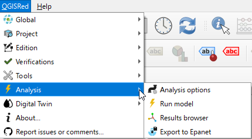

# 📊 Simulación y Resultados

Una vez definida la red, QGISRed permite realizar simulaciones hidráulicas y de calidad de agua utilizando el motor de EPANET.

### En esta sección:
*   [Ejecución del modelo](ejecucion.md)
*   [Visor de resultados](resultados.md)

> ❗ **IMPORTANTE**:
> Antes de simular, es recomendable pasar las [Verificaciones](../verificaciones/README.md) de topología.
