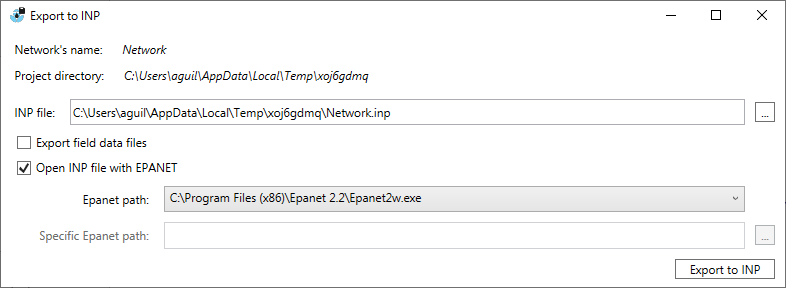

# Exportación del Modelo

QGISRed permite exportar el modelo de red al formato estándar **INP** de EPANET. Esta función resulta útil para compartir el modelo con otros usuarios, ejecutarlo directamente en la interfaz gráfica de EPANET o integrarlo con otras herramientas de análisis hidráulico.

Para acceder a la exportación, utiliza la opción **Export to INP** desde el menú correspondiente de QGISRed.

### Opciones de Exportación

Al lanzar la exportación, aparece el siguiente diálogo con las opciones disponibles:

Las opciones que presenta el diálogo son:

*   **INP file**: Ruta completa del archivo `.inp` que se generará. Puedes escribirla directamente o usar el botón `...` para navegar hasta la carpeta deseada.
*   **Export field data files**: Si esta opción está marcada, se exportarán también los archivos de datos de campo (ficheros auxiliares asociados al modelo).
*   **Open INP file with EPANET**: Si está activada, una vez completada la exportación se abrirá automáticamente el archivo INP en la aplicación EPANET instalada en tu equipo.
    *   **Epanet path**: Ruta al ejecutable de EPANET detectado en el sistema. Puedes seleccionar una versión diferente desde el desplegable si tienes varias instaladas.
    *   **Specific Epanet path**: Permite indicar manualmente la ruta a un ejecutable de EPANET que no aparezca en el listado anterior.

Una vez configuradas las opciones, pulsa el botón **Export to INP** para generar el archivo.
