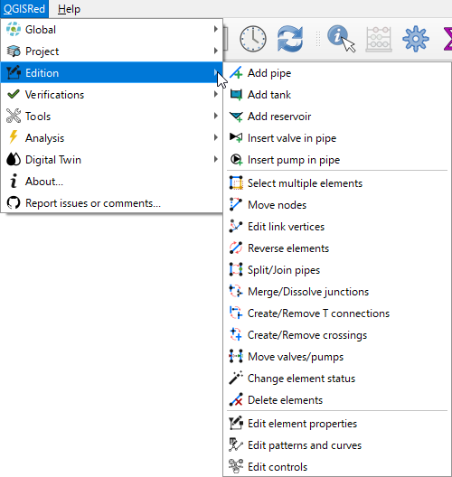

# 🏗️ Herramientas de Edición

QGISRed permite construir tu red de agua de forma visual e intuitiva directamente sobre el mapa de QGIS.

### ¿Qué puedes hacer?
*   [Creación de elementos básicos](creacion.md) (Tuberías, nudos, depósitos).
*   [Manipulación gráfica](manipulacion.md) (Mover nudos, editar vértices).
*   [Edición de propiedades](propiedades.md) (Diámetros, materiales, rugosidades).

---
> [!TIP]
> Al crear una tubería, QGISRed genera automáticamente los nudos extremos si no existen.
