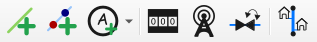

# Creación de Elementos

Usa la barra de herramientas de QGISRed para añadir elementos a tu modelo:

| Icono | Elemento | Acción |
| :--- | :--- | :--- |
|  | **Tubería** | Clic para inicio y fin. Crea nudos automáticamente. |
|  | **Depósito/Embalse** | Haz clic sobre un nudo existente para convertirlo. |
|  | **Válvula/Bomba** | Haz clic sobre una tubería para insertarla. |

> [!NOTE]
> Las válvulas y bombas dividen la tubería original de forma inteligente.
