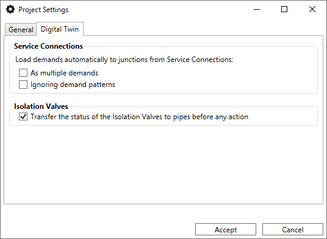

# Ejemplo 2: Creación de Red desde Cero

Este tutorial muestra cómo construir el modelo "Red1_SI" dibujando cada elemento directamente en el mapa.

### 1. Preparación
*   **Crear Proyecto**: Usa `Project > Create Project`, define el nombre y el CRS (ej: WGS 84).
*   **Autoensamblado (Snapping)**: Activa el imán de QGIS para que las tuberías conecten exactamente en los nudos.

### 2. Dibujo del Trazado
1.  **Tuberías**: Selecciona la herramienta de añadir tubería y dibuja el esquema. Haz clic derecho para terminar cada tramo.
2.  **Nudos y Depósitos**: Añade los elementos puntuales sobre los extremos de las tuberías.
3.  **Válvulas**: Inserta los elementos de regulación sobre las líneas existentes.

### 3. Introducción de Datos
*   Usa el **Editor de Propiedades** para clicar en cada elemento y asignar diámetros, rugosidades y demandas base.
*   **Coger Curvas**: Accede al gestor de curvas para definir la curva característica de la bomba (Flow-Head) y el patrón de demanda.

### 4. Validación y Ejecución
1.  **Validar**: Pulsa el botón de Verificación para crear automáticamente los nudos faltantes y consolidar la topología.
2.  **Reglas y Controles**: Define leyes de control (ej: apagar bomba si el nivel del depósito es > 5m).
3.  **Simular**: Ejecuta el modelo y verifica que los resultados coinciden con el diseño esperado.

