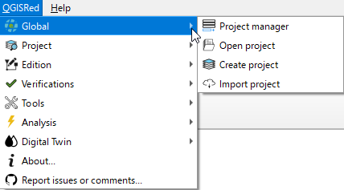
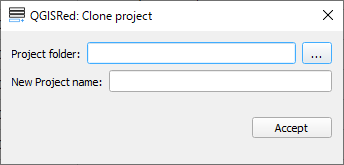

# Explorador de Proyectos

QGISRed utiliza un **Gestor de Proyectos** centralizado para administrar tus redes de agua.

### El Gestor de Proyectos
Esta ventana es el corazón de la administración de archivos en el plugin:
*   **Lista de Recientes**: Haz doble clic sobre cualquier proyecto para abrirlo instantáneamente.
*   **Cargar (Load)**: Te permite vincular un proyecto que no aparece en la lista. Solo necesitas el nombre de la red y el directorio.
*   **Renombrar**: Cambia el nombre del proyecto y actualiza automáticamente todos los archivos vinculados.
*   **Borrar/Unload**: Elimina un proyecto de la lista o del disco.
*   **Acceso Directo**: Botón para abrir directamente la carpeta del proyecto en Windows.

### Clonación de Proyectos
Si necesitas crear una variante de una red:
1.  Pulsa **Clonar**.
2.  Especifica el nuevo nombre.
3.  Elige el directorio (pueden convivir varios proyectos en una misma carpeta si tienen nombres distintos).

---
> 💡 **CONSEJO**:
> Recuerda que cualquier herramienta del plugin trabajará sobre los archivos del directorio del proyecto, no solo sobre lo que ves abierto en la leyenda de QGIS.
