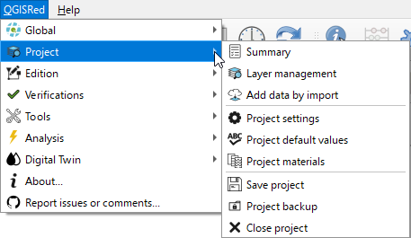

# Gestión de Capas e Inputs

Para construir un modelo hidráulico, QGISRed organiza la información en capas vectoriales específicas (SHP).

### Capas Principales (Inputs):
*   **Junctions**: Nudos de consumo.
*   **Pipes**: Tuberías de la red.
*   **Tanks/Reservoirs**: Depósitos y fuentes de suministro.
*   **Valves/Pumps**: Elementos de regulación y transporte.

---
> [!TIP]
> Puedes administrar la visibilidad de estas capas desde la herramienta de **Gestión de Capas** en el menú Proyecto.
