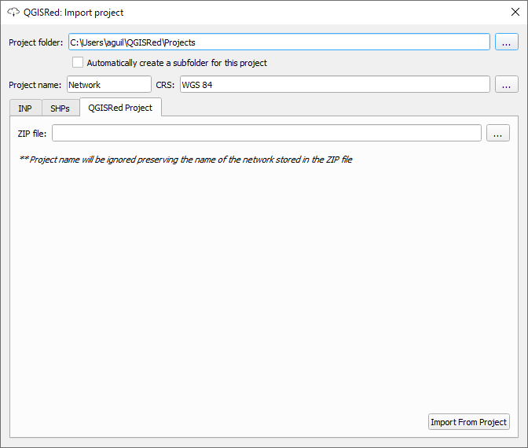

# Gestión de Capas e Inputs

QGISRed organiza la información en una estructura relacional sólida basada en archivos SHP.

### Creación de Proyecto (Inputs)
Al crear un nuevo proyecto, el plugin genera automáticamente un grupo llamado **"Inputs"** en la leyenda de QGIS.

Este grupo contiene al menos **6 archivos SHP**, uno por cada elemento base de EPANET:
1.  **Junctions** (Nudos de demanda)
2.  **Pipes** (Tuberías)
3.  **Tanks** (Depósitos)
4.  **Reservoirs** (Embalses)
5.  **Valves** (Válvulas)
6.  **Pumps** (Bombas)

### Gestión Avanzada de Capas
La herramienta de **Gestión de Capas** (Project > Layer Management) te permite:
*   Controlar la visibilidad de todas las capas del modelo.
*   **Recuperar capas eliminadas**: Si borras accidentalmente un SHP del proyecto, puedes volver a crearlo desde aquí sin perder la integridad del modelo.
*   **Definir Proyección**: Especificar el CRS de la información (Nota: esta herramienta no reproyecta, solo declara).

### Opciones y Valores por Defecto
Desde el menú **Project**, puedes acceder a:
*   **Opciones de Proyecto**: Notas del creador, nombre del escenario y configuraciones para el Gemelo Digital.
*   **Valores por Defecto**: Prefijos para nuevos elementos, holguras mínimas y valores hidráulicos iniciales.
*   **Tabla de Materiales**: Definición de rugosidades iniciales e incrementos anuales para el cálculo automático basado en la edad.

 
