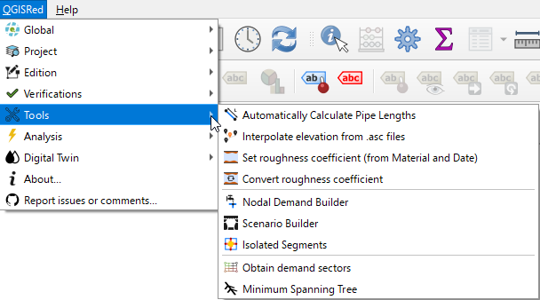

# 🛠️ Herramientas Avanzadas

Optimiza tu modelo con herramientas de procesamiento masivo.

### Funciones destacadas:
*   **Interpolación de Cotas**: Asigna elevaciones a todos los nudos automáticamente a partir de archivos MDT (ASCII).
*   **Gestor de Demandas**: Distribuye consumos por sectores o proximidad a nudos.
*   **Cálculo de Rugosidad**: Estima la rugosidad en función del material y la edad de la tubería (Hazen-Williams o Darcy-Weisbach).
*   **Explorador de Cerradas**: Determina qué válvulas cerrar para aislar una rotura.
