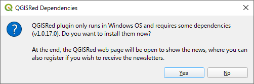

# Gestión de Dependencias

Al intentar usar una herramienta de QGISRed por primera vez, verás un aviso solicitando instalar dependencias adicionales.

> [!TIP]
> Estas dependencias no requieren permisos de administrador y se instalan automáticamente.

*   Si pulsas **Sí**, el plugin descargará los componentes necesarios (`GISRed libraries`).
*   Si pulsas **No**, no podrás usar las herramientas de análisis hasta que las instales.
