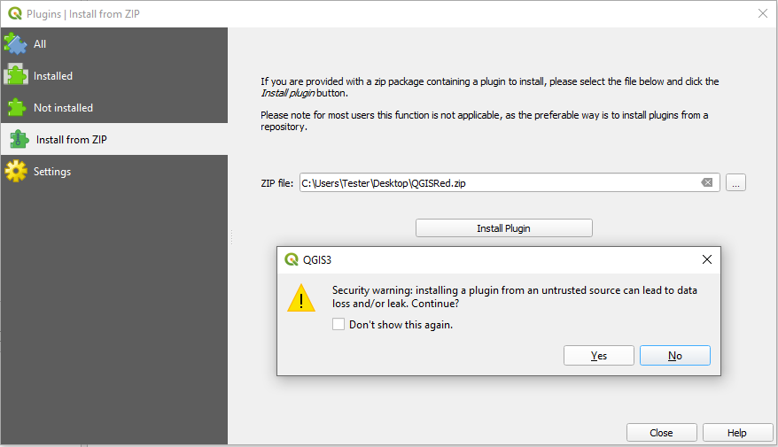

# Instalación desde ZIP Local

Si dispones de una versión específica en un archivo `.zip`, puedes instalarla manualmente:

1.  Abre QGIS.
2.  Ve al menú **Complementos > Administrar e instalar complementos...**.
3.  Selecciona la pestaña **Instalar a partir de ZIP**.
4.  Busca tu archivo `QGISRed.zip` y pulsa **Instalar complemento**.

> ⚠️ **ADVERTENCIA**:
> Verás un aviso de seguridad de QGIS al instalar desde un archivo local. Pulsa **Sí** para continuar.
