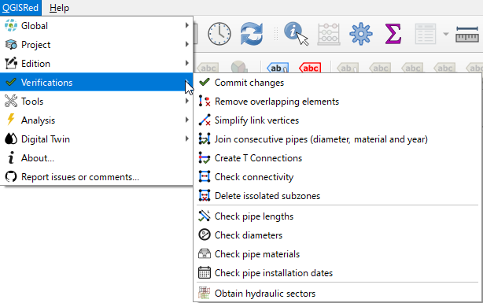

# 🔍 Verificaciones

QGISRed incluye un conjunto de herramientas para asegurar que tu modelo es hidráulicamente consistente y libre de errores topológicos.

### Herramientas principales:
*   **Consolidar Datos**: Verifica la integridad de todas las propiedades declaradas.
*   **Eliminar Elementos Superpuestos**: Detecta tuberías o nudos duplicados en la misma posición.
*   **Simplificar Vértices**: Elimina vértices innecesarios en líneas rectas para mejorar el rendimiento.
*   **Análisis de Conectividad**: Identifica zonas aisladas y subredes desconectadas.

---
> 💡 **CONSEJO**:
> Usa los **Sectores Hidráulicos** (Tipo A al D) para entender rápidamente cómo se alimenta cada parte de tu red.
